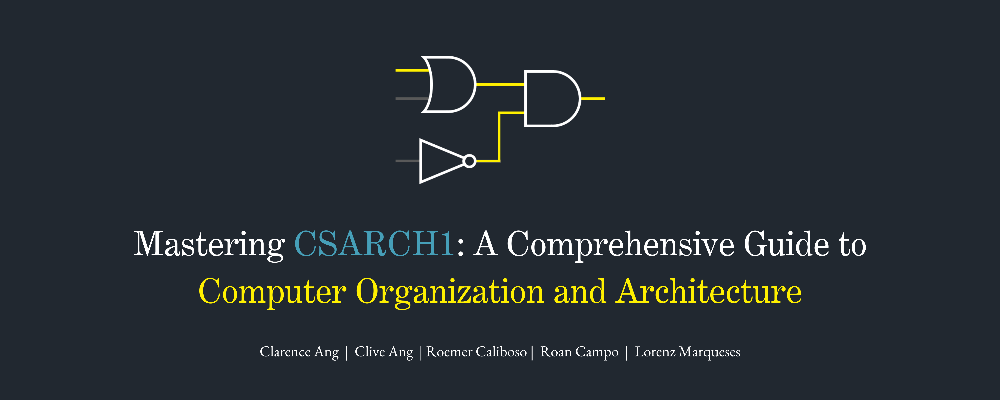

<p align="center">
  
  
  
  
</p>

## Table of Contents
- [Getting Started](#getting-started)
- [Course Content](#course-content)
- [Further Reading](#further-reading)
- [Contact](#contact)
## Getting Started

> [!Note]
> **Note**: This repository is still under development. Resources are being rolled out progressively, and new materials will be added over time. Feel free to check back regularly for updates.
> 
### Download with Git:

1. Clone the repository:
    ```bash
    git clone https://github.com/EvilConundrum/mastering-csarch1.git
    ```

2. Navigate to the repository directory:
    ```bash
    cd mastering-csarch1
    ```

3. Open the `curriculum` directory to access the content.

### Download Without Git:

1. Go to the top of this page and click the green Code button.

2. In the sub-menu, click "Download ZIP" as seen below:


3. Unzip the files.

4. Have fun with the materials!

## Course Content
```
mastering-csarch1/
├── curriculum/
│   ├── 1.0 [Module] - Introduction to Computer Organization and Architecture/
│   │   └── ...
│   ├── 2.0 [Module] - Boolean Algebra/
│   │   └── ...
│   ├── 3.0 [Module] - Analysis and Design/
│   │   └── ...
│   ├── 4.0 [Exam] - Long Exam 1/
│   │   └── ...
│   ├── 5.0 [Module] - Combinatorial Circuit/
│   │   └── ...
│   ├── 6.0 [Exam] - Long Exam 2/
│   │   └── ...
│   ├── 7.0 [Module] - Sequential Logic/
│   │   └── ...
│   └── 8.0 [Exam] - Long Exam 3/
│   │   └── ...
├── resources/
│   └── images/
└── README.md
```
### Key Topics Covered

#### Introduction to Computer Organization and Architecture
- Computer Organization and Architecture
- Analog vs. Digital Systems
- Number Systems and Base Conversion
- Binary Data Organization
- 2x vs 10y Ambiguity
- Radix Complements
- Unsigned and Signed Operations
- Binary Codes

#### Boolean Algebra
- To be added!

#### Analysis and Design
- To be added!

#### Hardware Description Language (HDL)
- To be added!

#### Combinatorial Circuit
- To be added!

#### Sequential Logic
- To be added!

### Problem Sets and Reviewers
- To be added!

## Further Reading
- To be added!

## Contact

For questions, mistakes, or feedback, feel free to reach out via:
- Email: [clive_jarel_c_ang@dlsu.edu.ph](mailto:clive_jarel_c_ang@dlsu.edu.ph)
- Discord: evilconundrum or EvilC#5174
- Github Issues: [Open an Issue](https://github.com/EvilConundrum/mastering-csarch1/issues)
